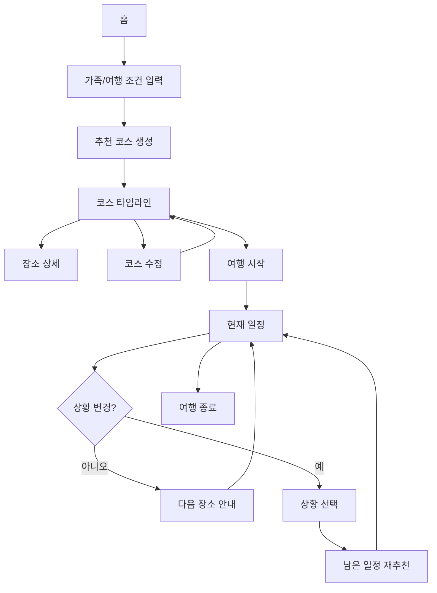
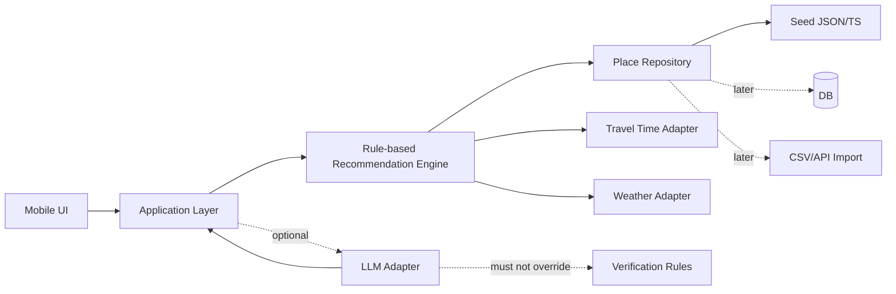

# PRD — 이천베베로드

> 문서 버전: v0.2  
> 상태: MVP 기획안  
> 지역: 경기도 이천  
> 핵심 타깃: 2세 전후 영유아를 동반한 자가용 당일치기 가족  
> 기준 페르소나: 김민지 가족  
> 제품 원칙: **많이 보는 여행보다, 아이와 부모가 무리하지 않는 여행**

## 1. Product Overview

### 제품명
**이천베베로드**


### 한 줄 소개
아이 나이, 유모차 사용 여부, 여행 가능 시간, 날씨, 이동수단을 입력하면 **영유아 가족이 실제로 소화 가능한 이천 당일치기 코스**를 만들어주는 모바일 우선 여행 큐레이션 서비스.

### Vision
이천의 관광지를 많이 보여주는 서비스가 아니라, 가족이 **“오늘 이 일정이면 진짜 갈 수 있겠다”**라고 판단할 수 있게 만드는 서비스가 된다.

### 핵심 가치 제안
- 장소 목록이 아니라 **하루 동선**을 제안한다.
- **유모차·수유실·기저귀 갈이대·주차·화장실·휴식 공간** 정보를 우선 노출한다.
- 아이 나이와 여행 가능 시간을 고려해 **과도한 일정은 자동으로 줄인다.**
- 날씨와 남은 시간에 따라 **실내/실외 장소를 교체**할 수 있게 한다.
- 식사와 카페도 별도 추천이 아니라 **동선의 일부**로 편성한다.
- 확인되지 않은 편의시설 정보는 숨기지 않고 **UNKNOWN / 확인 필요**로 표시한다.
- 핵심 일정 추천은 **설명 가능하고 테스트 가능한 규칙 기반(Logical) 엔진**으로 동작하며, AI는 선택적 보조 계층으로 분리한다.
- Seed Place는 데모용 고정 목록이 아니라 **확장 가능한 Place Repository의 초기 데이터**로 취급한다.

---

## 2. Background & Problem

### 배경
이천에는 쌀, 농업, 자연, 카페, 체험, 실내 학습시설 등 가족 단위로 활용할 수 있는 자원이 많다. 하지만 영유아 동반 가족에게 중요한 정보는 개별 블로그, 지도 리뷰, 시설 페이지 등에 흩어져 있다.

사용자는 다음 질문에 답하기 위해 여러 검색을 반복한다.

- 우리 아이 나이에 적합한가?
- 유모차로 이동 가능한가?
- 주차는 편한가?
- 주차장에서 입구까지 멀지 않은가?
- 수유실이 있는가?
- 기저귀 갈이대가 있는가?
- 아기의자가 있는가?
- 실내/실외 중 어디인가?
- 더운 날, 비 오는 날에도 가능한가?
- 부모가 앉아 쉴 수 있는가?
- 몇 분 정도 머무르면 적당한가?
- 다음 장소까지 얼마나 걸리는가?
- 하루에 몇 곳까지 현실적으로 갈 수 있는가?

### 실제 답사에서 확인한 문제
실제 답사는 9월 5일 토요일에 진행했다.

- 10:00 서울 신도림 출발
- 12:00경 이천 도착
- 자가용 이용
- 실제 방문 순서:
  1. 미솥지음 — 약 1시간
  2. 모가의 숲 — 약 1시간
  3. 이천농업테마공원 + 라이스카페 — 약 1시간 30분
  4. 이천시환경학습관 — 약 30분
  5. 을를 — 약 15분
- 성호호수연꽃단지는 더위와 시간 부족으로 방문하지 못함
- 17:30경 이천 출발
- 19:30경 신도림 도착

핵심 관찰:
- 자가용이어도 이천 도착 후 실제 관광 가능한 시간이 짧다.
- 5곳을 모두 방문하니 각 장소를 충분히 즐기기보다 **빠르게 훑고 이동하는 일정**이 되었다.
- 2세 전후 아이 가족은 관광지의 유명도보다 **이동·편의·휴식·날씨 대응**이 중요하다.
- 식사와 카페는 부가 요소가 아니라 여행 동선의 핵심 블록이다.
- 계획 당시 넣었던 성호호수는 실제 상황에서는 제외되었다. 즉, **고정 코스보다 재구성 가능한 코스가 필요하다.**

### Problem Statement
> 어린 자녀와 함께 이천 당일치기 여행을 하려는 부모는 식사·관광·휴식·편의시설·이동시간 정보를 각각 찾아 조합해야 하며, 아이의 나이와 날씨를 고려한 현실적인 하루 일정을 만들기 어렵다.

---

## 3. Target User

### Primary Persona — 김민지
- 30대 여성, 서울 거주
- 남편 + 17개월 아기 1명
- 서비스 UI에서는 아이 나이를 **2세**로 표기
- 장거리/야외 이동 시 유모차 사용
- 자가용으로 서울 근교 당일치기 여행을 선호
- 관광지를 많이 찍는 것보다 아이가 즐겁고 부모도 덜 지치는 일정을 선호
- 네이버 블로그, 지도 리뷰, 인스타그램, 맘카페 등을 반복 검색
- 주차, 유모차, 화장실, 수유실, 기저귀 갈이대, 아기의자, 실내 여부를 중요하게 봄
- “좋은 장소”보다 **“오늘 하루를 어떻게 움직일지”**가 더 큰 고민

### Secondary Target
- 3~7세 자녀를 둔 가족
- 조부모 + 영유아가 함께 움직이는 3세대 가족
- 이천에 처음 방문하는 서울/수도권 자가용 당일치기 가족

### Pain Points
1. 장소 정보는 많지만 하루 코스로 연결하기 어렵다.
2. 영유아 편의시설 정보가 흩어져 있거나 누락되어 있다.
3. 날씨와 아이 컨디션 변화에 따라 계획이 쉽게 깨진다.
4. 여행 시간을 과대평가해 너무 많은 장소를 넣기 쉽다.
5. 식사 장소가 관광 동선과 맞지 않으면 이동 손실이 커진다.
6. 실제 체류시간과 주차/승하차 시간을 예측하기 어렵다.

### JTBD
**When** 어린아이와 이천 당일치기 여행을 계획할 때,  
**I want to** 우리 가족 조건에 맞는 현실적인 하루 코스를 빠르게 만들고,  
**So I can** 검색을 반복하지 않고 아이와 부모 모두 무리 없이 여행하고 싶다.

---

## 4. Product Goals

### MVP 목표
사용자가 1~3분 안에 가족 조건을 입력하고 **현실적으로 실행 가능한 이천 하루 코스**를 받게 한다.

### 사용자 목표
- 어디를 몇 곳 갈지 빠르게 결정
- 아이에게 무리 없는 일정인지 판단
- 유모차/수유/기저귀 등 핵심 편의정보 즉시 확인
- 식사와 휴식 위치까지 한 번에 결정
- 날씨/지연 상황에서 코스를 줄이거나 변경

### Non-goals
MVP에서는 숙박 예약, 식당/체험 실시간 예약, 커뮤니티, 소셜 피드, 장문 리뷰, 전국 확장, 정교한 실시간 교통, 결제, 강제 회원가입을 하지 않는다.

---

## 5. User Journey

| 단계 | 사용자 행동 | 사용자 생각/문제 | 서비스 대응 |
|---|---|---|---|
| 진입 | 서비스 접속 | 어디부터 봐야 하지? | “우리 가족 코스 만들기” CTA |
| 조건 입력 | 출발지, 아이 나이, 유모차, 시간, 스타일 입력 | 너무 많이 입력하기 싫다 | 필수값 최소화 |
| 추천 생성 | 추천 버튼 클릭 | 하루에 몇 곳 가능하지? | 총시간 기반 3~4곳 중심 추천 |
| 결과 확인 | 타임라인 검토 | 너무 빡빡하지 않나? | 이동/체류/식사/버퍼 시각화 |
| 장소 확인 | 장소 상세 열기 | 유모차/수유/기저귀는? | 편의시설 최상단 |
| 수정 | 장소 삭제/교체 | 카페도 넣고 싶다 | 대체 장소/휴식 포인트 추천 |
| 여행 중 | 현재 일정 확인 | 시간이 밀렸다 | 남은 일정 재계산 |
| 상황 변경 | “아기가 잠듦”, “너무 더움” | 이제 어디 가지? | 실내/짧은 동선 중심 재추천 |
| 귀가 | 마지막 장소 종료 | 지금 출발하면 괜찮나? | 귀가 희망시간 기준 안내 |

---

## 6. Core User Flow



---

## 7. Functional Requirements

### P0-01 가족/여행 조건 입력
필수 입력:
- 출발지역
- 아이 나이
- 유모차 사용 여부
- 여행 날짜
- 출발시간
- 이천 출발 희망시간
- 이동수단
- 여행 스타일 1~3개

선택:
- 낮잠 시간
- 점심 포함 여부
- 실내 선호
- 부모 휴식 중요도

Acceptance Criteria:
- 필수 입력 완료 전 추천 버튼 비활성화
- 아이 나이는 개월/세 입력을 모두 수용할 수 있는 데이터 구조
- 17개월 → 2세처럼 표시 정책과 내부 값을 분리
- 모바일에서 1~2분 내 입력 가능

### P0-02 코스 추천 생성
처리:
- 여행 가능 총시간
- 식사
- 장소 체류시간
- 장소 간 이동시간
- 영유아 버퍼
- 운영시간
- 날씨
- 유모차 조건

출력:
- 추천 장소 3~4개
- 식사/휴식 포함 타임라인
- 예상 총 이동시간/체류시간/여유시간

Acceptance Criteria:
- 2세 이하 + 반나절 조건에서 5곳 이상 기본 추천 금지
- 일정이 빡빡하면 경고
- 운영시간 밖 장소 제외
- UNKNOWN을 YES처럼 취급하지 않음

### P0-03 타임라인
각 블록에 시작/종료시간, 장소명, 카테고리, 체류시간, 다음 이동시간, 핵심 편의정보, 실내/실외, 추천 이유를 표시한다.

### P0-04 장소 상세
최상단에 유모차, 수유실, 기저귀 갈이대, 아기의자, 주차, 화장실, 실내/실외, 추천 연령, 예상 체류시간, 운영시간, 검증 상태를 표시한다.

### P0-05 과밀 일정 경고
예:
> 현재 일정은 2세 아이와 이동하기에는 빠듯합니다. 장소 1곳을 줄이면 약 60분의 여유시간을 확보할 수 있어요.

### P0-06 기본 코스 수정
장소 삭제/교체/순서 변경/식사·카페 추가 제거 후 즉시 재계산한다.

### P0-07 입력값 적용 추적 및 검증
각 입력값은 실제 추천 로직에 반영되는지 추적 가능해야 한다. **UI에 존재하지만 추천 결과에 아무 영향도 주지 않는 입력값은 MVP에서 허용하지 않는다.**

필수 입력별 적용 예:

| 입력값 | 추천 로직 적용 | 테스트 방법 |
|---|---|---|
| 아이 나이 | 방문 수, 체류/버퍼, 연령 적합성 점수 | 동일 조건에서 2세/7세 결과 비교 |
| 유모차 사용 | `NO` 장소 제외, `UNKNOWN` 감점/경고 | ON/OFF 결과 비교 |
| 날짜 | 휴무/운영시간 판정 | 휴무일 fixture |
| 출발·귀가 시간 | 총 여행 가능시간/방문 수 계산 | 4시간/7시간 결과 비교 |
| 이동수단 | 이동시간 adapter 선택 | 자차/대중교통 fixture |
| 여행 스타일 | 카테고리 가중치 | 자연/실내 선호 결과 비교 |
| 낮잠 시간 | 활동 블록 배치/휴식 추천 | 낮잠 시간대 overlap test |
| 실내 선호 | 실내 장소 가중치 | ON/OFF 비교 |
| 부모 휴식 중요도 | 카페·휴식 블록 가중치 | high/low 비교 |

Acceptance Criteria:
- 모든 입력 필드는 최소 1개의 추천 규칙 또는 화면 동작과 연결된다.
- 입력값을 바꿨을 때 영향을 받아야 하는 결과가 테스트로 검증된다.
- 추천 결과에 `추천 근거`를 생성할 수 있도록 적용된 주요 조건을 내부적으로 기록한다.
- 추천 엔진 테스트에서 input-to-output traceability를 확인한다.

### P1
- 날씨 대응 재추천
- 여행 중 재계획
- 식사 동선 추천
- 부모 휴식 포인트 자동 삽입

### P2
- 지도 실시간 경로
- 날씨 API 실시간 연동
- 사용자 후기/사진
- 코스 공유
- 로그인/저장
- 이천 외 지역 확장
- 예약 링크


---

## 8. Recommendation Logic

### 8.1 기본 원칙
추천 엔진은 “좋은 장소 점수”보다 **실행 가능성**을 우선한다.

### 8.2 Hard Constraints
아래 조건 위반 시 기본 추천에서 제외:
- 운영시간 내 방문 불가
- 총 여행 가능시간 초과
- 유모차 필수 + `stroller_accessible = NO`
- 휴무
- 날씨상 명백히 부적합한 장소 + 대체 가능 장소 존재

`UNKNOWN`은 제외가 아니라 **조건부 추천** 처리한다.

### 8.3 Soft Score 예시
총 100점:
- 아이 연령 적합성: 25
- 영유아 편의성: 25
- 동선 효율: 20
- 날씨 적합성: 15
- 이천 지역성: 10
- 부모 휴식 가치: 5

가중치는 MVP에서 조정 가능한 상수로 관리한다.

### 8.4 시간 계산 규칙
다음은 **초기 제품 가설**이며 사용자 테스트로 조정한다.

- 식사: 기본 60분
- 카페/휴식: 기본 30분
- 일반 관광지: 장소별 `recommended_duration`
- 차량 주차/승하차 버퍼: 장소당 10분
- 2세 이하 추가 버퍼: 90분마다 15분
- 연속 야외활동: 2세 이하 기준 90분 초과 시 휴식 또는 실내 전환 권고
- 반나절(약 5~6시간) + 2세 이하: 관광/식사 포함 기본 3~4개 블록 권장

### 8.5 방문 수 제한
- 0~2세: 3~4개
- 3~5세: 4개
- 6세 이상: 4~5개

식사/카페도 추천 엔진에서는 모두 시간 블록으로 계산한다.

### 8.6 Pseudocode

```text
INPUT:
  trip_conditions
  candidate_places

trip_window = calculate_available_time(
  arrival_in_icheon,
  desired_departure_from_icheon
)

eligible = []

FOR place IN candidate_places:
  IF place.closed_on(trip_date):
    CONTINUE

  IF not fits_opening_hours(place, trip_window):
    CONTINUE

  IF stroller_required AND place.stroller_accessible == NO:
    CONTINUE

  place.score = 0
  place.score += age_fit_score(place, child_age)
  place.score += family_facility_score(place)
  place.score += weather_score(place, weather)
  place.score += local_identity_score(place)
  place.score += parent_rest_score(place)

  IF stroller_required AND place.stroller_accessible == UNKNOWN:
    place.score -= unknown_penalty

  eligible.append(place)

routes = generate_candidate_routes(
  eligible,
  include_meal=True,
  max_stops=get_max_stops(child_age)
)

FOR route IN routes:
  route.total_time =
      sum(place.duration)
    + sum(route.travel_time)
    + meal_time
    + parking_boarding_buffer
    + toddler_buffer

  IF route.total_time > trip_window:
    reject(route)
    CONTINUE

  route.route_score =
      sum(place.score)
    - detour_penalty(route)
    - schedule_density_penalty(route)
    + diversity_bonus(route)

best_route = highest_score(routes)

IF best_route.slack_time < minimum_slack(child_age):
  attach_warning("일정이 빠듯합니다")
  suggest_remove_lowest_value_stop(best_route)

RETURN best_route
```

---

## 9. Place Data Schema

장소 단위의 `verified_status`만으로는 부족하다. 예를 들어 주차는 현장 확인했지만 수유실은 웹 정보만 있을 수 있으므로, **중요 편의정보는 필드 단위 출처와 검증일을 저장**한다.

```ts
type TriState = "YES" | "NO" | "UNKNOWN";

type DataSourceType =
  | "FIELD_VISIT"
  | "OFFICIAL"
  | "PUBLIC_DATA"
  | "BUSINESS_PAGE"
  | "MAP_REVIEW"
  | "USER_REPORT"
  | "UNKNOWN";

type EvidenceValue<T> = {
  value: T;
  source_type: DataSourceType;
  source_ref?: string;       // URL, 문서 ID, 현장답사 ID 등
  collected_at?: string;
  verified_at?: string;
  confidence?: "HIGH" | "MEDIUM" | "LOW";
  note?: string;
};

type VerificationStatus =
  | "FIELD_VERIFIED"
  | "WEB_VERIFIED"
  | "USER_REPORTED"
  | "UNVERIFIED";

type Place = {
  id: string;
  name: string;
  category:
    | "RESTAURANT"
    | "CAFE"
    | "NATURE"
    | "PARK"
    | "MUSEUM"
    | "EXPERIENCE"
    | "INDOOR"
    | "OTHER";

  address: string;
  lat?: number;
  lng?: number;

  opening_hours?: OpeningHours;
  closed_days?: string[];

  recommended_duration_min: number;
  recommended_duration_max?: number;

  parking: EvidenceValue<TriState>;
  stroller_accessible: EvidenceValue<TriState>;
  nursing_room: EvidenceValue<TriState>;
  diaper_changing_station: EvidenceValue<TriState>;
  baby_chair: EvidenceValue<TriState>;
  toilet: EvidenceValue<TriState>;
  shade: EvidenceValue<TriState>;
  rest_area: EvidenceValue<TriState>;

  indoor_outdoor: "INDOOR" | "OUTDOOR" | "MIXED";
  age_min_months?: number;
  age_max_months?: number;

  weather_tags: Array<
    "HOT_OK" | "RAIN_OK" | "COLD_OK" | "HOT_AVOID" | "RAIN_AVOID"
  >;

  reservation_required: TriState;
  price_note?: string;

  local_identity_tags?: string[];

  verified_status: VerificationStatus;
  verified_date?: string;
  source?: string;
  verification_note?: string;

  field_visit?: {
    visited: boolean;
    visited_date?: string;
    actual_duration_min?: number;
    note?: string;
  };
};
```

### 데이터 원칙
- 편의시설은 반드시 `YES / NO / UNKNOWN`
- 확인 안 된 값을 추정으로 채우지 않음
- 현장 확인과 웹 확인을 구분
- **주차·유모차·수유실·기저귀 갈이대·아기의자·화장실·휴식공간은 필드별 provenance를 저장**
- 마지막 확인일 저장
- 오래된 정보는 “재확인 필요” 상태를 만들 수 있게 설계
- 추천 엔진은 특정 장소명을 하드코딩하지 않고 `PlaceRepository` 인터페이스에서 후보 장소를 조회

### Place Repository 원칙
```ts
interface PlaceRepository {
  listCandidates(filters?: PlaceQuery): Promise<Place[]>;
  getById(id: string): Promise<Place | null>;
}
```

MVP에서는 JSON/TypeScript seed repository를 사용하되, 이후 DB·CSV import·공공데이터·외부 API adapter로 교체 가능해야 한다.

---

## 10. Seed Place Data

MVP 초기 장소:
1. 미솥지음
2. 모가의 숲
3. 이천농업테마공원
4. 라이스카페
5. 이천시환경학습관
6. 을를
7. 성호호수연꽃단지

### 현장 방문 여부
- 미솥지음: 방문
- 모가의 숲: 방문
- 이천농업테마공원: 방문
- 라이스카페: 방문
- 이천시환경학습관: 방문
- 을를: 방문
- 성호호수연꽃단지: 미방문

주의:
- 유모차/수유실/기저귀 갈이대 등 세부 편의시설은 **확인 데이터가 없는 경우 UNKNOWN으로 시작**
- 성호호수는 현장 확인 완료 장소처럼 표현하지 않음
- Seed Place의 목적은 추천 엔진의 데모/검증이며 서비스 전체 장소 범위를 제한하지 않는다.

### Seed Data 확보 원칙
초기 Seed Data는 아래 우선순위로 확보한다.

1. **현장답사 데이터** — 직접 확인한 체류시간, 동선, 편의시설
2. **시설/지자체 공식 정보** — 운영시간, 주소, 시설 안내
3. **공공데이터** — 이용 가능하고 라이선스가 적합한 경우
4. **사업자 공식 페이지** — 식당/카페 운영·편의정보
5. **지도/리뷰 기반 정보** — 보조 근거로만 사용, 검증 수준을 낮게 표시
6. **사용자 제보** — P2 이후, 즉시 확정값으로 쓰지 않고 검증 대기

데이터가 충돌하면 최신성·공식성·현장 확인 여부를 기준으로 우선순위를 정한다.

### Seed 밖의 장소 추가 방식
MVP 이후 장소 확장은 다음 경로를 지원하도록 설계한다.

- 관리자/운영자 수동 등록
- CSV/JSON 일괄 import
- 공공데이터/API adapter
- 승인된 외부 데이터 source adapter
- 사용자 제보 → 검수 → 공개

새 장소는 `Place` 스키마와 검증 규칙만 만족하면 추천 후보에 자동 포함될 수 있어야 하며, 장소명을 추천 로직에 직접 하드코딩하지 않는다.

---

## 11. Screens / Information Architecture

### Screen 1. 홈
목적: 서비스 가치를 5초 안에 이해시키고 조건 입력으로 이동.

주요 UI:
- “이천베베로드, 무리 없는 하루 코스를 만들어드려요”
- `우리 가족 코스 만들기` CTA
- 유모차 / 기저귀 / 수유 / 실내 / 주차 핵심 아이콘

### Screen 2. 여행 조건 입력
- 출발지역
- 아이 나이
- 유모차
- 날짜
- 출발시간
- 이천 출발 희망시간
- 이동수단
- 스타일 태그
- 낮잠 시간(선택)

CTA: `코스 추천받기`

### Screen 3. 추천 코스 결과
- “오늘은 4곳이 적당해요”
- 총 관광시간
- 총 이동시간
- 여유시간
- 날씨 주의
- 타임라인

CTA:
- `이 코스로 가기`
- `장소 바꾸기`
- `한 곳 줄이기`

### Screen 4. 코스 타임라인
- 시간 블록
- 장소/이동/식사/휴식 구분
- 현재 일정 강조
- 지연 시 재계산

### Screen 5. 장소 상세
최상단:
- 유모차
- 수유실
- 기저귀
- 아기의자
- 주차
- 실내/실외

중단:
- 추천 이유
- 적정 체류시간
- 운영시간
- 연령 적합성

하단:
- 검증 출처
- 마지막 확인일
- `이 장소로 교체`

### Screen 6. 코스 수정
- 드래그 순서 변경
- 삭제
- 대체 후보
- 일정 밀도 경고

### Screen 7. 여행 중 현재 일정
- 현재 장소
- 다음 장소
- 다음 출발 권장시간
- `30분 늦어졌어요`
- `아기가 잠들었어요`
- `너무 더워요`
- `비가 와요`

---

## 12. UX Principles

1. 모바일 퍼스트
2. 한 손 사용
3. 긴 설명보다 핵심 정보 우선
4. 유모차/수유/기저귀/주차를 장소 소개보다 위에 배치
5. UNKNOWN을 숨기지 않음
6. 과도한 장소 추천 금지
7. “많이 보는 여행”보다 “무리 없는 여행”
8. 경고는 대안과 함께 제시
9. 영유아 시간 버퍼를 명시
10. 유명도보다 실행 가능성을 우선

---

## 13. Example Scenario — 김민지 가족

### 입력
- 출발: 서울 신도림
- 자가용
- 부모 2명
- 아이: 2세(실제 17개월)
- 유모차 사용
- 서울 출발 10:00
- 이천 도착 약 12:00
- 이천 출발 희망 17:30
- 점심 필요
- 무더운 날씨

### 실제 답사
미솥지음 → 모가의 숲 → 농업테마공원+라이스카페 → 환경학습관 → 을를

결과:
- 방문 자체는 가능했지만 전체적으로 빠르게 훑는 일정
- 성호호수는 더위/시간 때문에 미방문
- 5곳은 “충분히 즐기는 여행” 기준으로 과밀

### 서비스가 제안할 기본 코스 예시 — 무더운 날
1. 12:00~13:00 미솥지음
2. 13:20~14:50 이천농업테마공원 + 라이스카페
3. 15:20~16:00 이천시환경학습관
4. 16:20~17:00 을를 또는 바로 귀가 준비
5. 17:30 이천 출발

제외/대체 후보:
- 모가의 숲: 더위가 약하거나 아이 컨디션이 좋을 때 추가
- 성호호수: 더위/시간 조건상 제외

추천 문구:
> 오늘은 2세 아이와 무더운 날씨를 고려해 4개 블록이 적당해요.  
> 모가의 숲과 성호호수는 다음 방문 후보로 남겨둘게요.

---

## 14. Success Metrics

### 핵심
- 코스 생성 완료율
- 조건 입력 → 결과 확인 전환율
- “이 일정이면 실제 갈 수 있겠다” 만족도
- 일정 과밀 경고 수용률
- 편의시설 정보 유용성 평가

### 보조
- 장소 상세 조회율
- 장소 교체율
- 코스 수정 완료율
- 코스 저장/공유율(P2)
- UNKNOWN 편의정보 확인 요청률

### 초기 목표 예시
- 코스 생성 완료율: 70%+
- 결과 화면 도달 후 이탈률: 35% 이하
- “실제 갈 수 있겠다” 5점 척도 평균 4.0+
- 편의정보 유용성 5점 척도 평균 4.2+

※ 수치는 MVP 가설이며 실제 테스트 후 조정.

---

## 15. Edge Cases

| 상황 | 서비스 대응 |
|---|---|
| 출발이 늦어짐 | 남은 시간 재계산, 가장 가치 낮은 장소 제거 제안 |
| 식당 웨이팅 | 이후 일정 자동 밀기 + 1곳 축소 제안 |
| 아이 낮잠 | 드라이브/카페/실내 등 저자극 장소 우선 |
| 아이 컨디션 저하 | 귀가 또는 1곳만 남기는 축약 코스 |
| 폭염 | 야외 연속 방문 제한 |
| 비 | 실내 대체 |
| 장소 임시휴무 | 즉시 제외 + 인근 대체 |
| 주차 불가 | 조건부 경고 + 다른 장소 우선 |
| 급한 수유/기저귀 | 확인된 편의시설 장소 우선 |
| 장소를 너무 많이 선택 | 과밀 경고 + 자동 축소 |
| 편의시설 UNKNOWN | “확인 필요” + 메인 추천 점수 일부 감점 |

---

## 16. Non-functional Requirements

### 성능
- 초기 화면 LCP 목표: 2.5초 이하
- 추천 생성: 로컬 데이터 기준 1초 이내 목표

### 접근성
- WCAG AA 수준 목표
- 아이콘만 쓰지 않고 텍스트 병기
- 터치 타깃 최소 44px 권장

### 개인정보
- MVP 비회원 기본
- 위치 권한 강제 금지
- 출발지역은 자유 텍스트 또는 시/구 단위
- 민감정보 수집 금지

### 구조
- 장소 데이터와 추천 엔진 분리
- 지도/날씨 API는 adapter 형태
- API key는 환경변수
- 장소 데이터 업데이트 가능 구조
- SEO 가능한 공개 장소 상세 페이지 고려

---

## 17. MVP Scope

### 반드시 구현
- 홈
- 여행 조건 입력
- seed place 데이터
- 가족 조건 기반 추천
- 일정 타임라인
- 과밀 일정 경고
- 장소 상세
- 편의시설 3상태 표시
- 장소 삭제/교체
- 모바일 반응형

### 이번 버전에서는 하지 않음
- 로그인
- 결제
- 예약
- 실시간 교통
- 커뮤니티
- 사용자 후기 작성
- 전국 확장
- 복잡한 AI 챗봇
- 실시간 날씨 API 필수 연동
- 관리자 CMS 완성형

---

## 18. Recommended Technical Direction

> 기존 프로젝트가 있으면 기존 스택을 우선한다. 새로 시작하는 경우 권장안.

- Next.js App Router
- TypeScript
- Tailwind CSS
- Zod
- seed data: TypeScript/JSON
- 상태 관리: 우선 React state / URL params, 필요 시 Zustand
- 테스트: Vitest + React Testing Library, E2E는 Playwright
- 지도/날씨: MVP에서는 adapter + mock 가능
- 배포: Vercel 등

추천 구조:

```text
src/
  app/
  components/
  features/
    trip-input/
    itinerary/
    places/
    replanning/
  domain/
    recommendation/
    scheduling/
  data/
    places/
  lib/
  types/
```

---


## 19. Data Acquisition & Governance

### 19.1 어떤 데이터를 어디서 확보하는가

| 데이터 | 1차 소스 | 2차 소스 | 미확인 처리 |
|---|---|---|---|
| 주소/운영시간 | 공식 시설/사업자/지자체 | 공공데이터 | UNKNOWN/재확인 |
| 주차 | 현장답사/공식안내 | 사업자 페이지 | UNKNOWN |
| 유모차 이동 | 현장답사 | 공식 무장애 안내 | UNKNOWN |
| 수유실 | 현장답사/공식 시설안내 | 공공 편의시설 데이터 | UNKNOWN |
| 기저귀 갈이대 | 현장답사/공식 시설안내 | 공공 편의시설 데이터 | UNKNOWN |
| 아기의자 | 현장답사/사업자 확인 | 신뢰도 낮은 리뷰 | UNKNOWN |
| 화장실 | 현장답사/공식 시설안내 | 공공데이터 | UNKNOWN |
| 휴식 공간/그늘 | 현장답사 | 공식 시설안내 | UNKNOWN |
| 실제 체류시간 | 현장답사/사용 데이터 | 운영자 추정 | default + 가설 표기 |
| 이동시간 | 지도/경로 adapter | seed matrix | 추정치 표시 |

### 19.2 데이터 검증 수준
사용자에게 표시할 검증 배지:
- **현장 확인**: 직접 답사로 확인
- **공식 정보**: 시설/지자체/공공 출처
- **웹 정보**: 사업자 또는 보조 웹 출처
- **정보 확인 필요**: 충분한 근거 없음

### 19.3 갱신 정책
- 운영시간: 출시 전 재검증, 이후 정기 갱신 대상
- 영유아 편의시설: 6~12개월마다 재검증 권장
- 현장 정보 변경 제보가 들어오면 재검증 큐에 등록
- `verified_at`이 정책 기준을 넘으면 UI에서 “최근 정보 재확인 필요” 표시 가능

### 19.4 데이터 품질 KPI
- 핵심 장소 중 편의시설 UNKNOWN 비율
- 최근 12개월 내 검증된 필드 비율
- 사용자 오류 제보 건수
- 외부 정보와 현장 정보 불일치율

---

## 20. Rule-based vs AI Architecture Decision

### 20.1 MVP 결정
**P0 핵심 추천 엔진은 AI가 아닌 규칙 기반/점수 기반 로직으로 구현한다.**

이유:
1. 일정 가능 여부는 운영시간·체류시간·이동시간·버퍼처럼 구조화된 계산 문제다.
2. 같은 입력에 같은 결과를 내야 테스트가 쉽다.
3. 왜 장소가 포함/제외됐는지 설명 가능하다.
4. LLM 장애/비용/환각이 핵심 기능을 막지 않는다.
5. 초기 사용자 수가 적을 때 데이터와 추천 규칙을 먼저 검증할 수 있다.

### 20.2 Logical 계산만으로 가능한 서비스 완성도
규칙 기반만으로도 MVP의 핵심 가치는 충분히 검증 가능하다.

가능:
- 시간 가능한 코스 생성
- 과밀 일정 탐지
- 유모차/연령/날씨 조건 필터
- 식사·휴식 블록 배치
- 운영시간 검증
- 사용자가 선택한 조건 반영
- 추천 근거 표시

한계:
- 자유문장 요구 해석
- “우리 아기는 낯선 곳에서 잘 못 자요” 같은 비정형 선호 반영
- 새로운 장소를 자동으로 탐색·요약
- 긴 리뷰의 의미 기반 분석
- 자연어 대화형 일정 수정

따라서 **MVP는 Rule-based core + 추후 Optional AI layer**의 하이브리드 구조를 채택한다.

### 20.3 AI를 사용할 경우의 역할
AI는 추천의 최종 안전/시간 계산자가 아니라 다음에 한정한다.

P1/P2 후보:
- 자연어 요구를 구조화된 조건으로 변환
- 추천 결과를 짧고 친절하게 설명
- 리뷰/공식 안내문에서 편의시설 후보 정보 추출
- 사용자의 자유문장 일정 변경 요청 해석
- 검색 후보 장소 요약

AI가 만든 정보는 검증 없이 `FIELD_VERIFIED` 또는 `OFFICIAL`로 승격하지 않는다.

### 20.4 AI 장애 시
LLM API가 실패하거나 예산 한도에 도달해도:
- 조건 입력
- 코스 추천
- 시간 계산
- 과밀 경고
- 장소 상세
- 코스 수정
은 정상 작동해야 한다.

---

## 21. AI Provider, Budget & Guardrails

> 이 섹션은 AI 기능을 실제로 활성화할 때 적용한다. **MVP P0에서는 LLM이 필수가 아니다.**

### 21.1 Provider/Model 선택 원칙
특정 모델을 PRD에 하드코딩하지 않는다. `LLMProvider` adapter를 두고 다음 기준으로 벤치마크 후 선택한다.

- 한국어 이해/요약 품질
- JSON/Structured Output 안정성
- 응답 속도
- 입력/출력 단가
- 개인정보/로그 정책
- 장애율 및 rate limit
- 모델 버전 변경 대응

```ts
interface LLMProvider {
  parseTripRequest(input: string): Promise<TripIntent>;
  explainRecommendation(context: RecommendationContext): Promise<string>;
}
```

### 21.2 AI 사용처 허용 목록
초기 허용:
1. 자유문장 → 여행 조건 구조화
2. 추천 결과 설명문 생성
3. 운영자용 데이터 후보 추출

초기 금지:
- LLM 단독으로 장소 운영 여부 판단
- LLM 단독으로 수유실/기저귀 갈이대 존재 확정
- LLM 단독으로 이동시간 생성
- LLM 단독으로 일정 feasibility 판정

### 21.3 비용 한도
실제 금액은 제품 오너가 개발 전에 확정해야 하는 **Blocking Decision**이다.

PRD 기본 정책:
- 월 예산이 설정되지 않으면 AI 기능은 OFF
- 요청당 최대 token/비용 한도 설정
- 일/월 hard cap 설정
- 사용자별 rate limit
- 동일 설명 요청 cache
- structured input을 우선 사용해 불필요한 긴 prompt 방지
- 예산 80% 도달 시 경고
- 예산 100% 도달 시 graceful fallback → 규칙 기반 결과만 제공

환경변수 예:
```text
AI_ENABLED=false
LLM_PROVIDER=
LLM_MODEL=
AI_MONTHLY_BUDGET_KRW=
AI_DAILY_REQUEST_LIMIT=
AI_MAX_COST_PER_REQUEST_KRW=
```

### 21.4 AI 품질 검증
AI 활성화 전 최소 benchmark set:
- 20개 한국어 자연어 여행 요청
- 조건 추출 정확도
- JSON schema valid rate
- 추천 설명 사실성
- 금지된 정보 추정 여부
- 평균 비용/요청
- p95 latency

기준을 통과한 모델만 운영에 사용한다.

---

## 22. Input Application & Recommendation QA

### 22.1 목적
“입력창은 있지만 실제 추천에 반영되지 않는” 기능을 방지한다.

### 22.2 테스트 레이어
1. **Unit Test** — 각 변수별 점수/필터/시간 계산
2. **Pairwise Scenario Test** — 입력 하나만 바꿔 결과 차이를 검증
3. **Golden Scenario Test** — 김민지 실제 답사 시나리오
4. **Boundary Test** — 2시간/4시간/6시간, 0세/2세/7세 등
5. **Regression Test** — 추천 로직 수정 후 기존 핵심 시나리오 유지

### 22.3 필수 Golden Scenario
김민지:
- 신도림
- 자차
- 17개월(표시 2세)
- 유모차 ON
- 이천 12:00 도착
- 17:30 출발
- 점심 필요
- 무더운 날

Expected:
- 5곳을 기본 코스로 강제하지 않음
- 야외 연속 일정에 감점
- 성호호수 우선순위 낮음
- 3~4개 블록 중심
- 식사/휴식/영유아 버퍼 포함
- UNKNOWN 편의시설은 확정처럼 표시하지 않음

### 22.4 추천 설명 로그
개발/QA 모드에서는 각 추천 결과에 다음 debug 정보를 볼 수 있게 한다.
- included_reason[]
- excluded_reason[]
- score_breakdown
- time_breakdown
- applied_inputs[]
- warnings[]

운영 UI에는 필요한 설명만 축약해서 표시한다.

---

## 23. Place Expansion Architecture

### 23.1 핵심 원칙
현재 7개 Seed Place는 **초기 검증 데이터일 뿐 제품 범위가 아니다.**

추천 엔진은:
```text
사용자 조건
→ PlaceRepository에서 후보 조회
→ Hard Constraint
→ Score
→ Route/Schedule 생성
```
순으로 작동하며, 장소명별 분기문을 만들지 않는다.

### 23.2 확장 단계
**MVP:** 수동 검증 Seed 7~20곳  
**Pilot:** 이천 가족여행 후보 30~50곳 큐레이션  
**Scale:** 외부 데이터 adapter + 운영 검수  
**Later:** 사용자 제보 및 반자동 검증

### 23.3 신규 Place 등록 최소 조건
- name
- category
- address 또는 좌표
- 운영시간 상태
- recommended_duration 가설
- indoor/outdoor
- 최소 1개 출처
- 핵심 편의시설은 YES/NO/UNKNOWN 중 하나

필수값을 만족하지 못하면 공개 추천 대상이 아니라 `DRAFT` 상태로 둔다.

---

## 24. Architecture Summary



핵심 원칙:
- **Rule engine이 source of truth**
- **LLM은 optional**
- **PlaceRepository는 확장 가능**
- **모든 핵심 편의 데이터는 provenance 보유**
- **모든 입력은 테스트 가능한 로직에 연결**


## 25. Development Roadmap

### Phase 1 — 클릭 가능한 MVP + 입력 적용 검증
홈 → 조건 입력 → seed repository → 규칙 기반 추천 → 타임라인 → 장소 상세.  
각 입력값이 추천 결과에 실제 반영되는지 unit/pairwise/golden test를 함께 구현한다.

### Phase 2 — 데이터 확장 기반
PlaceRepository 추상화, 필드별 provenance, CSV/JSON import, 운영 검수 흐름을 추가한다. Seed 7곳에 고정되지 않게 만든다.

### Phase 3 — 추천 정교화 + 외부 Adapter
연령별 버퍼, 유모차/편의시설 가중치, 장소 교체, 과밀 일정 경고, 지도/거리·날씨 adapter를 연동한다.

### Phase 4 — 여행 중 동적 재추천
지연, 낮잠, 폭염/비, 현재 상황 기반 재구성.

### Phase 5 — Optional AI
AI 예산과 provider가 승인된 경우에만 자연어 조건 추출/추천 설명 기능을 실험한다. 핵심 추천은 계속 규칙 기반으로 유지한다.

---

## 26. Open Questions

- 장소별 실제 유모차 이동 가능 범위
- 수유실 존재 여부
- 기저귀 갈이대 위치/존재 여부
- 식당/카페 아기의자 여부
- 주차장에서 입구까지 실제 거리
- 장소별 평균 체류시간
- 아이 연령별 적합성
- 모가의 숲의 계절별/날씨별 활용성
- 환경학습관의 영유아 실제 체류 만족도
- 라이스카페의 혼잡 시간대
- 을를을 필수 휴식 포인트로 볼지 선택형으로 볼지
- 장소 운영시간 데이터 유지보수 방식
- 실시간 길찾기 API 도입 시점
- ‘2세’ 표시 정책: 실제 개월 수 병기 여부
- 핵심 편의시설 각 항목의 공식/현장 데이터 확보 책임자
- Seed Place를 몇 곳까지 수동 검증한 뒤 Pilot을 시작할지
- 장소 추가/수정 승인 프로세스
- AI 기능을 켤지 여부와 월/일/요청당 예산 한도
- AI 도입 시 provider/model benchmark 기준과 승인자

---

## 27. MVP 핵심 한 문장

> **아이 나이와 여행 가능 시간을 기준으로, 무리하지 않는 이천 하루 코스를 만들어주는 것.**

---

## 28. 첫 번째로 구현할 화면 3개

1. **여행 조건 입력** — 추천 근거 생성
2. **추천 코스 결과** — 제품의 핵심 가치
3. **장소 상세** — “아이와 실제로 갈 수 있나?” 판단

이 세 화면만 연결되어도 핵심 가설을 테스트할 수 있다.

---

## 29. 개발 시작 전 결정 체크리스트

- [x] 서비스 이름 확정 — **이천베베로드**
- [ ] 기존 프로젝트/새 프로젝트 여부
- [ ] 기술 스택 확정
- [ ] 지도 API를 MVP에서 쓸지 mock으로 시작할지
- [ ] 날씨 API를 1차 버전에 넣을지
- [ ] 장소 데이터 JSON/DB 선택
- [ ] 아이 나이 입력 정책
- [ ] 운영시간/편의시설 검증 주체
- [ ] `UNKNOWN` UI 문구
- [ ] 장소 3~4개 추천 기준 세부값
- [ ] 디자인 톤앤매너
- [ ] 각 입력값이 실제 추천에 미치는 영향표 승인
- [ ] 장소 데이터 1차 소스와 검증 책임자
- [ ] Seed 이후 Place 확장 방식(CSV/DB/API) 결정
- [ ] AI 사용 여부(기본 OFF)
- [ ] AI 사용 시 provider/model benchmark 및 비용 한도 승인

---

## 30. 개발 에이전트에게 넘길 순서

1. PRD 읽기 + repo audit
2. domain type / place seed data
3. trip input
4. recommendation + scheduling core
5. itinerary result UI
6. place detail
7. edit/recalculate
8. tests
9. mobile polish
10. P1 replanning

상세 개발 프롬프트는 `DEVELOPMENT_PROMPTS.md`를 사용한다.
